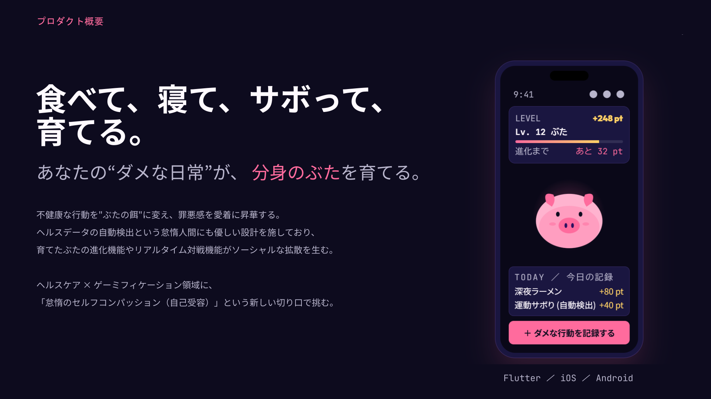

# 🐷 ぶたそだて －全人類ぶた化計画

**食べて、寝て、サボって、育てる。** 

「正しさ」で人を縛る従来の健康アプリは3ヶ月で消される。ぶたそだては逆転の発想で、不健康な行動を"ぶたの餌"に変え、罪悪感を愛着に昇華する。ヘルスデータの自動検出で怠惰人間でも継続でき、育てたぶた同士のリアルタイム対戦がソーシャルな拡散を生む。

Flutter（iOS/Android）× AWSサーバーレス構成。ヘルスケア × ゲーミフィケーション領域に「怠惰のセルフコンパッション（自己受容）」という新しい切り口で挑む。

**AWS SUMMIT JAPAN 2026 ／ AI-DLC HACKATHON
TEAM ぶたさんち**

<a href="docs/ぶたそだて_概要説明.pdf">
  
</a>

> 概要説明資料 📄 [PDF版](docs/ぶたそだて_概要説明.pdf) ／ 📊 [PPTX版](docs/ぶたそだて_概要説明.pptx)

---

## なぜ作るか

健康アプリ、続いたことある？

「今日も1万歩歩きましょう」 — うるせえ。

人類は"正しさ"に疲れた。毎日届く運動通知、カロリー計算、睡眠スコア。真面目に続けた人間がどれだけいる？ほとんどが3ヶ月以内にアプリを消している。

我々は立ち上がった。いや、座ったままだ。

| 観点 | 🏥 従来 — 正しさで縛るアプリ | 🐷 ぶたそだて — ダメさを愛させるアプリ |
|------|---|---|
| 記録対象 | "運動した""野菜を食べた"など健康行動 | "深夜ラーメン""運動サボり"など不健康行動 |
| 記録方法 | 手動入力が前提。面倒で続かない | 3タップ手動 or ヘルスデータ自動記録。怠惰でも継続可能 |
| 表示画面 | 数値グラフと達成率。義務感 | 成長したぶた。報酬感 |
| 動機設計 | 義務感・罪悪感 | 愛着・好奇心 |
| 継続性 | 能動的アクションが継続せず大半が離脱 | 記録自動化により自動で継続 |
| 感情帰結 | 「自分はダメだ」→ アンインストール | 「俺のぶた可愛い」→ セルフコンパッション |

**ユーザーの罪悪感がぶたの餌となり、愛玩的な幸福感に昇華される。**

> "ダメな自分"を客観視し、キャラとして可愛がる体験。セルフコンパッション(自身への優しさ)を育み、社会に疲れたユーザーを優しく包み込む。

---

## 「人をダメにする」を体現する6つの仕掛け

| # | 仕掛け | やってること | 対応FR |
|---|--------|-------------|--------|
| 01 | 🍜 **罪悪感をぶたの餌に変える** | 深夜ラーメン・運動サボり・夜更かしを記録すると、ぶたが喜び成長する。記録のメンタルモデル自体を反転させた。 | FR-2 |
| 02 | ⚖️ **怠惰の重症化でぶたが"進化"する** | 体重増加、睡眠不足など、怠惰の種類に応じてぶたが進化。健康指標の悪化がゲーム的快感や収集意欲に変換される。 | FR-4 |
| 03 | 📱 **ヘルスデータが"サボり検出器"** | 歩数や睡眠時間を自動取得し、運動不足や夜更かしを自動検出。記録すら不要。怠惰人間でも継続可能。 | FR-3 |
| 04 | ⚔️ **ダメさで他人と殴る** | 育てたぶた同士でリアルタイム対戦。夜更かし頻度やサボりスキルがバトルステータスになり、怠惰な自分の映し鏡が相手を蹂躙する。 | FR-5 |
| 05 | 👥 **ダメさを感染させる** | "今日の俺のぶた"を友達と見せ合い、SNSシェアで周囲の人間まで怠惰化させる。共有された罪悪感は、もう罪悪感ではない。 | FR-6 |
| 06 | 💗 **ダメな自分を愛する装置** | "ダメな自分"を客観視し、キャラとして可愛がる。社会の競争に疲れたユーザーを優しく包み込む、世界初の逆転ヘルスケアゲーム。 | 全体 |

---

## 機能要件 FR-1〜7

| ID | 作戦名 | 概要 | 道具 |
|----|--------|------|------|
| FR-1 | 🔐 **ぶた化対象者登録** | メール + Google / X ソーシャルログイン、プロフィール管理 | Cognito, OAuth |
| FR-2 | 🍜 **堕落記録** | カテゴリ選択式の3タップ手動入力 + 自動検出 + 履歴 | 3-tap UI, Auto-detect |
| FR-3 | 📱 **生体モニタリング** | 体重 / BMI / 歩数 / 睡眠を1日1回同期。キミの怠惰を自動検出 | HealthKit, Health Connect |
| FR-4 | 🐷 **肥育進化** | 進化分岐 + AI生成画像 / 短動画 + ステータス + スキル。ダメなほど強くなる | AI画像, 進化分岐 |
| FR-5 | ⚔️ **ぶたバトル** | WebSocket双方向通信、マッチメイキング、ステータス+スキル制。切断したら負け | WebSocket |
| FR-6 | 👥 **感染拡大** | フレンド検索 / 申請 / 承認、対戦相手追加、SNS共有。仲間をぶたにしろ | OS共有 |
| FR-7 | 🛠️ **全ぶた統制** | React製管理画面。ユーザー / ゲームデータ / マスターデータ管理 | React, /admin |

---

### 非機能要件

| ID | 要件 | 一言 |
|----|------|------|
| NFR-1 | 高速なパフォーマンス | ぶたは鈍いが通信は速い |
| NFR-2 | サーバーレス自動スケール / 〜100人 | バズったら落ちるかも |
| NFR-3 | 基本可用性（デモ向け） | まずはデモ中に使えたら十分 |
| NFR-4 | 3タップ以内 / 日本語UI | 怠惰人間に4タップは酷 |
| NFR-5 | ヘルスデータ同意 + 暗号化 | ダメさは暗号化して守る |

---

## ユーザーストーリー

| FR | 本数 | 領域 |
|----|------|------|
| FR-1 | 6 | ユーザー認証 |
| FR-2 | 5 | 不健康行動の記録 |
| FR-3 | 11 | ヘルスデータ連携 |
| FR-4 | 8 | アバター育成 |
| FR-5 | 10 | バトル |
| FR-6 | 6 | ソーシャル |
| FR-7 | 11 | 管理画面 |
| **合計** | **57** | **全領域制圧** |

---

## システム構成

```text
┌─────────────────┐     ┌─────────────────┐
│  Flutter App    │     │  React Admin    │
│  (iOS/Android)  │     │  (全ぶた統制室)    │
└────────┬────────┘     └────────┬────────┘
         │ REST + WebSocket       │ REST
         ▼                        ▼
┌─────────────────────────────────────────┐
│       API Gateway【堕落の門】            │
│   REST: /player/*  /admin/*             │
│   WebSocket: wss://                     │
└────────┬──────────────────┬─────────────┘
         ▼                  ▼
┌─────────────────┐  ┌─────────────────┐
│  Lambda (REST)  │  │ Lambda (WS)     │
│ 【怠惰の演算装置】│  │【ぶた闘の審判】    │
└────────┬────────┘  └────────┬────────┘
         │                     │
         ▼                     ▼
┌─────────────────────────────────────────┐
│  DynamoDB【無限の脂肪貯蔵庫】             │
│  Users | Avatars | Records | Battles    │
│  Friends | MasterData                   │
└─────────────────────────────────────────┘
         │
    ┌────┴────┐
    ▼         ▼
┌────────┐ ┌────────┐
│Cognito │ │  S3    │
│【対象者 │ │【進化画像│
│ 認証局】│ │ のぶた舎】│
└────────┘ └────────┘
```

| AWSサービス | 二つ名 | 役割 |
|------------|--------|------|
| API Gateway | 堕落の門 | REST + WebSocket エンドポイント管理 |
| Lambda (REST) | 怠惰の演算装置 | 全REST API処理（モノリシック） |
| Lambda (WebSocket) | ぶたバトルの審判 | バトルリアルタイム通信 |
| DynamoDB | 無限の脂肪貯蔵庫 | データ永続化（Table per Entity） |
| Cognito | ぶた化対象者認証局 | 認証（メール + Google + X） |
| S3 | 進化画像のぶた舎 | 事前生成AIアセット保存 |

---

### 設計方針

| 項目 | 方針 |
|------|------|
| FE構成 | Feature-first ＋ 軽量クリーン |
| バトル状態 | サーバー側で完全管理（チートさせない） |
| AIアセット | 事前生成 / S3配信（リアルタイム生成はしない） |
| 通知 | バトルはWS / 他はポーリング（怠惰に優しい設計） |

---

## Unit of Work

| Unit | 規模 | 作戦名 | 対応FR | stories | 完了条件 |
|------|------|--------|--------|---------|---------|
| 01 | 小 | 認証基盤 | FR-1 | 6 | ログイン → トークン取得 → 認証付きAPI呼び出しが動く |
| 02 | 大 | 記録＋ヘルス | FR-2,3 | 16 | 手動記録 → ポイント加算、ヘルスデータ自動検出が動く |
| 03 | 中-大 | アバター育成 | FR-4 | 8 | ポイント加算 → レベルアップ → 進化/退化まで動く |
| 04 | 大 | バトル＋ソーシャル | FR-5,6 | 16 | マッチング → バトル → 結果、フレンド申請まで動く |
| 05 | 中 | 管理画面 | FR-7 | 11 | React + Admin Domain。CRUD完備。Unit 2以降に並行着手 |

```text
FLOW: U1 認証 → U2 記録＋ヘルス → U3 アバター → U4 バトル＋SNS
      U5 管理画面 ／ U2 以降に 1人が並行で黙々と作る
```

---

### 提出物

`aidlc-docs/` に**全31ファイル**を格納。

```text
aidlc-docs/
├── aidlc-state.md              # 進捗の単一情報源
├── audit.md                    # 監査ログ（AIとの全会話記録）
└── inception/
    ├── requirements/           # FR-1〜7 / NFR-1〜5
    │   └── requirements.md ＋ 確認質問 3 docs
    ├── user-stories/           # 57 stories / 2 personas
    │   ├── personas.md
    │   ├── stories-fr1〜7.md
    │   └── battle-ui-mock.html
    ├── application-design/     # 7 設計ドキュメント
    │   ├── application-design.md
    │   ├── components.md / component-methods.md
    │   ├── services.md / component-dependency.md
    │   └── unit-of-work.md / unit-of-work-story-map.md
    └── plans/                  # 各フェーズ計画
```
