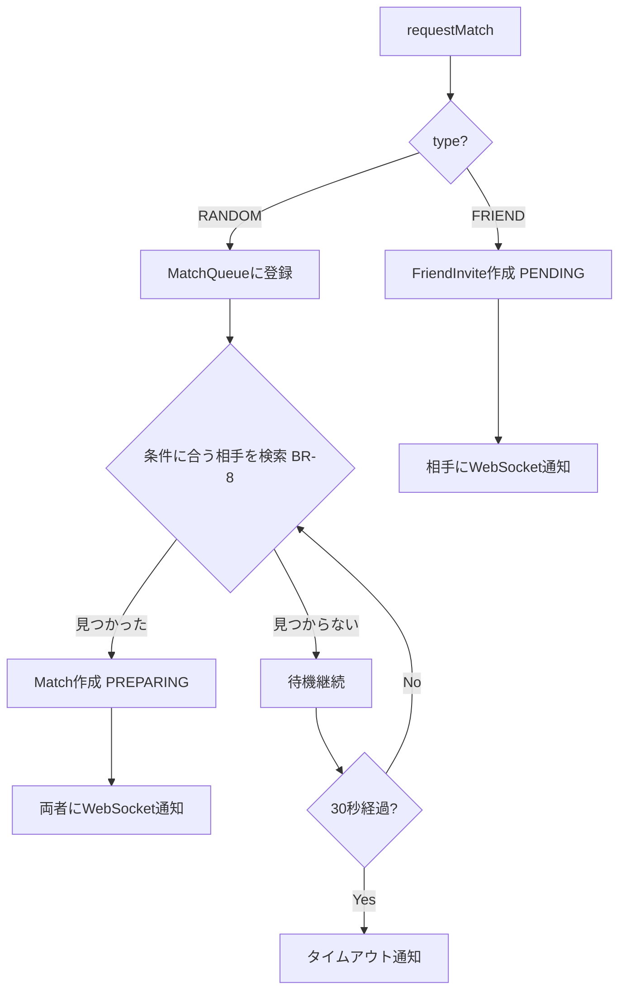
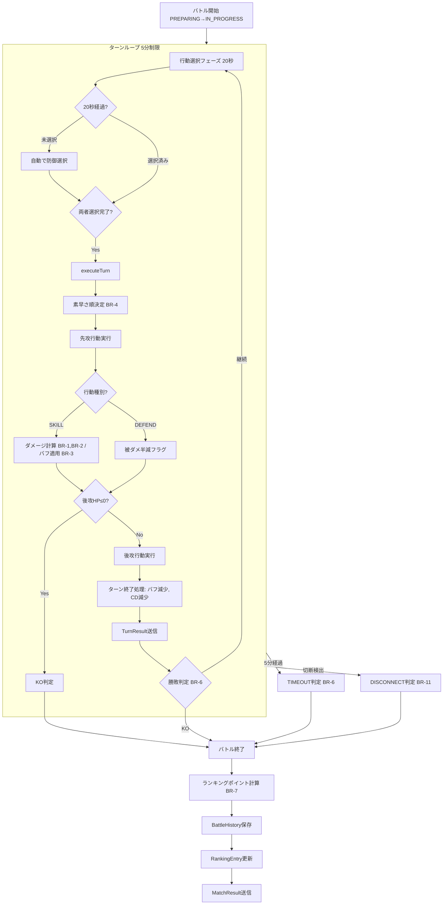
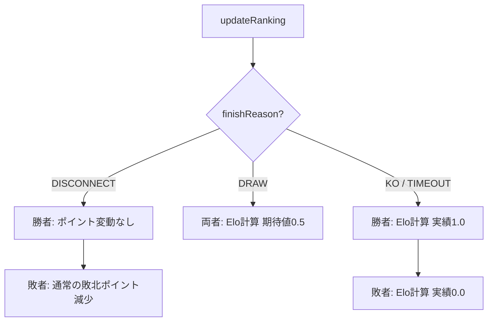
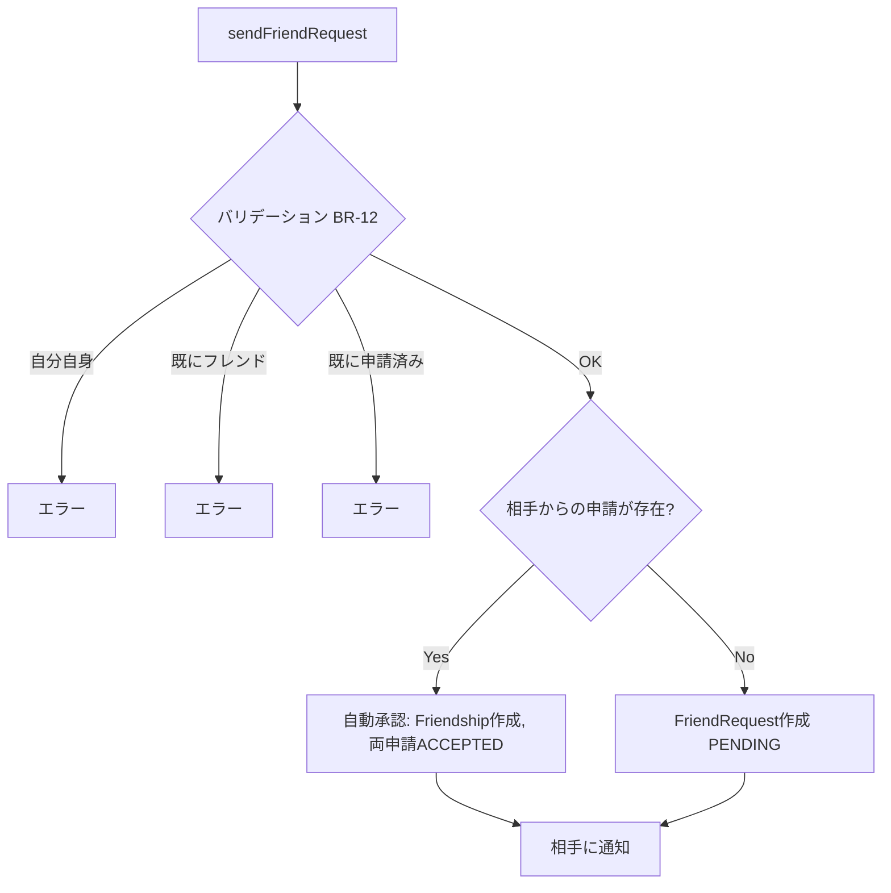
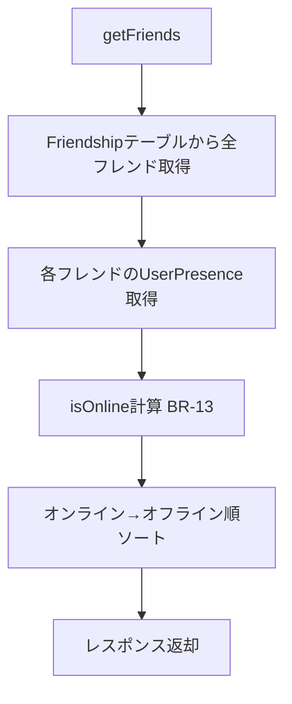
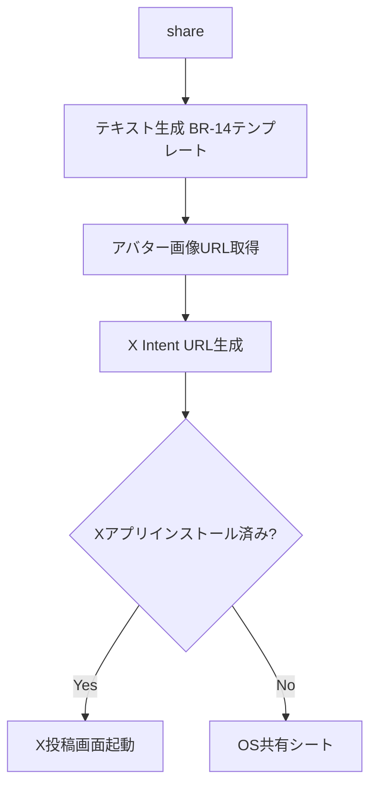

# Unit 4: バトル + ソーシャル - ビジネスロジックモデル

## バトルサービス フロー

### 1. マッチメイキングフロー

### 2. バトル実行フロー

### 3. ランキング更新フロー

---

## ソーシャルサービス フロー

### 4. フレンド申請フロー

### 5. フレンド一覧取得フロー

### 6. SNS共有フロー（フロントエンド主導）

---

## WebSocket メッセージ定義

### クライアント → サーバー
| type | payload | 説明 |
|------|---------|------|
| REQUEST_MATCH | { type: RANDOM } | ランダムマッチ申請 |
| CANCEL_MATCH | {} | マッチングキャンセル |
| INVITE_FRIEND | { targetUserId } | フレンド対戦招待 |
| RESPOND_INVITE | { inviteId, accept } | 招待応答 |
| SET_READY | { matchId, skills[] } | バトル準備完了 |
| SELECT_ACTION | { matchId, action } | ターン行動選択 |
| HEARTBEAT | {} | 生存確認 |

### サーバー → クライアント
| type | payload | 説明 |
|------|---------|------|
| MATCH_FOUND | { matchId, opponent } | マッチ成立 |
| MATCH_TIMEOUT | {} | マッチングタイムアウト |
| INVITE_RECEIVED | { inviteId, from } | 招待受信 |
| INVITE_RESPONSE | { accepted } | 招待応答結果 |
| BATTLE_START | { matchId, initialState } | バトル開始 |
| TURN_RESULT | { turnResult } | ターン結果 |
| BATTLE_END | { matchResult } | バトル終了 |
| OPPONENT_DISCONNECTED | {} | 相手切断 |
| ACTION_TIMEOUT | {} | 行動選択タイムアウト警告 |
