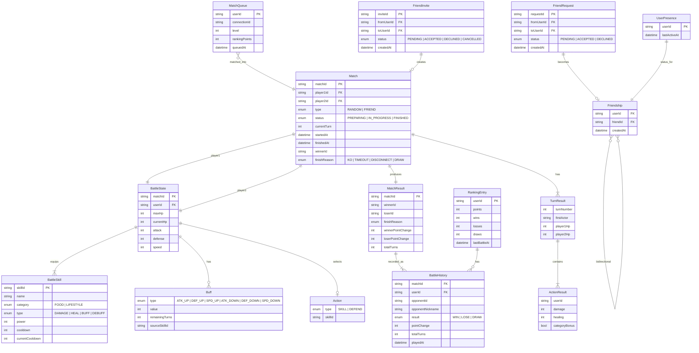

# Unit 4: バトル + ソーシャル - ドメインエンティティ

## バトルドメイン

### Match（対戦）
| フィールド | 型 | 説明 |
|-----------|-----|------|
| matchId | string (ULID) | 対戦ID |
| player1Id | string | プレイヤー1のuserId |
| player2Id | string | プレイヤー2のuserId |
| type | enum: RANDOM / FRIEND | 対戦種別 |
| status | enum: PREPARING / IN_PROGRESS / FINISHED | 対戦状態 |
| currentTurn | number | 現在ターン数 |
| startedAt | ISO8601 | バトル開始時刻 |
| finishedAt | ISO8601? | バトル終了時刻 |
| winnerId | string? | 勝者userId（DRAWならnull） |
| finishReason | enum: KO / TIMEOUT / DISCONNECT / DRAW | 終了理由 |

### BattleState（バトル中の各プレイヤー状態）
| フィールド | 型 | 説明 |
|-----------|-----|------|
| matchId | string | 対戦ID |
| userId | string | プレイヤーID |
| maxHp | number | 最大HP |
| currentHp | number | 現在HP |
| attack | number | 攻撃力（アバターステータスから） |
| defense | number | 防御力 |
| speed | number | 素早さ |
| skills | BattleSkill[] | セットしたスキル（最大4） |
| buffs | Buff[] | 適用中バフ/デバフ |
| selectedAction | Action? | 今ターンの選択行動 |

### BattleSkill（バトル用スキル）
| フィールド | 型 | 説明 |
|-----------|-----|------|
| skillId | string | スキルID |
| name | string | スキル名 |
| category | enum: FOOD / LIFESTYLE | 不健康カテゴリ属性 |
| type | enum: DAMAGE / HEAL / BUFF / DEBUFF | 効果タイプ |
| power | number | 威力/効果量 |
| cooldown | number | クールダウンターン数 |
| currentCooldown | number | 残りクールダウン |
| description | string | 効果説明 |

### Buff（バフ/デバフ）
| フィールド | 型 | 説明 |
|-----------|-----|------|
| type | enum: ATK_UP / DEF_UP / SPD_UP / ATK_DOWN / DEF_DOWN / SPD_DOWN | 効果種別 |
| value | number | 変動量（%） |
| remainingTurns | number | 残りターン数 |
| sourceSkillId | string | 発生元スキルID |

### Action（ターン行動）
| フィールド | 型 | 説明 |
|-----------|-----|------|
| type | enum: SKILL / DEFEND | 行動種別 |
| skillId | string? | 使用スキルID（SKILL時） |

### TurnResult（ターン結果）
| フィールド | 型 | 説明 |
|-----------|-----|------|
| turnNumber | number | ターン番号 |
| firstActor | string | 先攻userId |
| actions | ActionResult[] | 各プレイヤーの行動結果 |
| player1Hp | number | ターン後P1のHP |
| player2Hp | number | ターン後P2のHP |

### ActionResult（行動結果）
| フィールド | 型 | 説明 |
|-----------|-----|------|
| userId | string | 行動者 |
| action | Action | 実行した行動 |
| damage | number? | 与えたダメージ |
| healing | number? | 回復量 |
| buffApplied | Buff? | 付与したバフ/デバフ |
| categoryBonus | boolean | カテゴリ相性ボーナス発動 |

### MatchResult（対戦結果）
| フィールド | 型 | 説明 |
|-----------|-----|------|
| matchId | string | 対戦ID |
| winnerId | string? | 勝者 |
| loserId | string? | 敗者 |
| finishReason | string | 終了理由 |
| winnerPointChange | number | 勝者ポイント変動 |
| loserPointChange | number | 敗者ポイント変動 |
| totalTurns | number | 総ターン数 |

---

## マッチメイキングドメイン

### MatchQueue（マッチング待機）
| フィールド | 型 | 説明 |
|-----------|-----|------|
| userId | string | 待機中ユーザー |
| connectionId | string | WebSocket接続ID |
| level | number | アバターレベル |
| rankingPoints | number | ランキングポイント |
| queuedAt | ISO8601 | 待機開始時刻 |

### FriendInvite（フレンド対戦招待）
| フィールド | 型 | 説明 |
|-----------|-----|------|
| inviteId | string | 招待ID |
| fromUserId | string | 招待者 |
| toUserId | string | 被招待者 |
| status | enum: PENDING / ACCEPTED / DECLINED / CANCELLED | 状態 |
| createdAt | ISO8601 | 作成時刻 |

---

## ランキングドメイン

### RankingEntry（ランキング）
| フィールド | 型 | 説明 |
|-----------|-----|------|
| userId | string | ユーザーID |
| points | number | ランキングポイント（初期1000） |
| wins | number | 勝利数 |
| losses | number | 敗北数 |
| draws | number | 引き分け数 |
| lastBattleAt | ISO8601? | 最終バトル日時 |

### BattleHistory（バトル履歴）
| フィールド | 型 | 説明 |
|-----------|-----|------|
| matchId | string | 対戦ID |
| userId | string | 自分のuserId |
| opponentId | string | 相手のuserId |
| opponentNickname | string | 相手ニックネーム |
| result | enum: WIN / LOSE / DRAW | 結果 |
| pointChange | number | ポイント変動 |
| totalTurns | number | 総ターン数 |
| finishReason | string | 終了理由 |
| playedAt | ISO8601 | 対戦日時 |

---

## ソーシャルドメイン

### Friendship（フレンド関係）
| フィールド | 型 | 説明 |
|-----------|-----|------|
| userId | string | ユーザーA |
| friendId | string | ユーザーB |
| createdAt | ISO8601 | フレンド成立日時 |

### FriendRequest（フレンド申請）
| フィールド | 型 | 説明 |
|-----------|-----|------|
| requestId | string (ULID) | 申請ID |
| fromUserId | string | 申請者 |
| toUserId | string | 被申請者 |
| status | enum: PENDING / ACCEPTED / DECLINED | 状態 |
| createdAt | ISO8601 | 申請日時 |

### UserPresence（オンライン状態）
| フィールド | 型 | 説明 |
|-----------|-----|------|
| userId | string | ユーザーID |
| lastActiveAt | ISO8601 | 最終アクティブ時刻 |
| isOnline | boolean (computed) | 5分以内ならtrue |

---

## ER図

