# Execution Plan

## Detailed Analysis Summary

### Change Impact Assessment
- **User-facing changes**: Yes — フルスタックモバイルアプリ（Flutter）+ 管理画面（React）
- **Structural changes**: Yes — 新規システムアーキテクチャ全体の設計が必要
- **Data model changes**: Yes — DynamoDB テーブル設計、ユーザー/アバター/バトル/フレンドデータ
- **API changes**: Yes — REST API + WebSocket API の新規設計
- **NFR impact**: Yes — リアルタイムバトル200ms以内、API 500ms以内、同時接続100人

### Risk Assessment
- **Risk Level**: Medium
- **Rollback Complexity**: Easy（新規プロジェクト）
- **Testing Complexity**: Complex（WebSocket、ヘルスデータ連携、AI生成）

## Workflow Visualization

```mermaid
flowchart TD
    Start(["User Request"])

    subgraph INCEPTION["🔵 INCEPTION PHASE"]
        WD["Workspace Detection<br/><b>COMPLETED</b>"]
        RA["Requirements Analysis<br/><b>COMPLETED</b>"]
        US["User Stories<br/><b>COMPLETED</b>"]
        WP["Workflow Planning<br/><b>COMPLETED</b>"]
        AD["Application Design<br/><b>EXECUTE</b>"]
        UG["Units Generation<br/><b>EXECUTE</b>"]
    end

    subgraph CONSTRUCTION["🟢 CONSTRUCTION PHASE"]
        FD["Functional Design<br/><b>EXECUTE</b>"]
        NFRA["NFR Requirements<br/><b>EXECUTE</b>"]
        NFRD["NFR Design<br/><b>EXECUTE</b>"]
        ID["Infrastructure Design<br/><b>EXECUTE</b>"]
        CG["Code Generation<br/><b>EXECUTE</b>"]
        BT["Build and Test<br/><b>EXECUTE</b>"]
    end

    subgraph OPERATIONS["🟡 OPERATIONS PHASE"]
        OPS["Operations<br/><b>PLACEHOLDER</b>"]
    end

    Start --> WD
    WD --> RA
    RA --> US
    US --> WP
    WP --> AD
    AD --> UG
    UG --> FD
    FD --> NFRA
    NFRA --> NFRD
    NFRD --> ID
    ID --> CG
    CG --> BT
    BT --> OPS
    OPS --> End(["Complete"])

    style WD fill:#4CAF50,stroke:#1B5E20,stroke-width:3px,color:#fff
    style RA fill:#4CAF50,stroke:#1B5E20,stroke-width:3px,color:#fff
    style US fill:#4CAF50,stroke:#1B5E20,stroke-width:3px,color:#fff
    style WP fill:#4CAF50,stroke:#1B5E20,stroke-width:3px,color:#fff
    style AD fill:#FFA726,stroke:#E65100,stroke-width:3px,stroke-dasharray: 5 5,color:#000
    style UG fill:#FFA726,stroke:#E65100,stroke-width:3px,stroke-dasharray: 5 5,color:#000
    style FD fill:#FFA726,stroke:#E65100,stroke-width:3px,stroke-dasharray: 5 5,color:#000
    style NFRA fill:#FFA726,stroke:#E65100,stroke-width:3px,stroke-dasharray: 5 5,color:#000
    style NFRD fill:#FFA726,stroke:#E65100,stroke-width:3px,stroke-dasharray: 5 5,color:#000
    style ID fill:#FFA726,stroke:#E65100,stroke-width:3px,stroke-dasharray: 5 5,color:#000
    style CG fill:#4CAF50,stroke:#1B5E20,stroke-width:3px,color:#fff
    style BT fill:#4CAF50,stroke:#1B5E20,stroke-width:3px,color:#fff
    style OPS fill:#BDBDBD,stroke:#424242,stroke-width:2px,stroke-dasharray: 5 5,color:#000
    style Start fill:#CE93D8,stroke:#6A1B9A,stroke-width:3px,color:#000
    style End fill:#CE93D8,stroke:#6A1B9A,stroke-width:3px,color:#000
    linkStyle default stroke:#333,stroke-width:2px
```

## Phases to Execute

### 🔵 INCEPTION PHASE
- [x] Workspace Detection (COMPLETED)
- [x] Requirements Analysis (COMPLETED)
- [x] User Stories (COMPLETED - FR-1~FR-7)
- [x] Workflow Planning (COMPLETED)
- [ ] Application Design - EXECUTE
  - **Rationale**: 新規コンポーネント多数、コンポーネント間依存関係とAPI設計が必要
- [ ] Units Generation - EXECUTE
  - **Rationale**: 7つのFRを実装ユニットに分割、フロント/バック/インフラの分離が必要

### 🟢 CONSTRUCTION PHASE
- [ ] Functional Design - EXECUTE
  - **Rationale**: DynamoDBスキーマ、進化ロジック、バトルロジック、ポイント計算の設計
- [ ] NFR Requirements - EXECUTE
  - **Rationale**: リアルタイムバトル200ms、API 500ms、同時接続100人の要件定義
- [ ] NFR Design - EXECUTE
  - **Rationale**: WebSocket設計、DynamoDB容量設計、Lambda最適化パターン
- [ ] Infrastructure Design - EXECUTE
  - **Rationale**: AWS サーバーレス構成の詳細設計
- [ ] Code Generation - EXECUTE (ALWAYS)
  - **Rationale**: 実装コード生成
- [ ] Build and Test - EXECUTE (ALWAYS)
  - **Rationale**: ビルド・テスト手順生成

### 🟡 OPERATIONS PHASE
- [ ] Operations - PLACEHOLDER

## Estimated Timeline
- **Total Stages**: 12
- **Completed**: 4
- **Remaining**: 8

## Success Criteria
- **Primary Goal**: ハッカソンMVP完成（不健康行動記録 + アバター育成 + リアルタイムバトル + 管理画面）
- **Key Deliverables**: Flutter アプリ、AWS バックエンド、React 管理画面
- **Quality Gates**: 全FR機能動作、バトルレイテンシ200ms以内、API 500ms以内
