# AWSシステム構成図

```mermaid
graph TB
    subgraph Client["クライアント"]
        Flutter["Flutter App<br/>(iOS / Android)"]
        AdminSPA["管理画面 SPA<br/>(React)"]
    end

    subgraph AWS["AWS (ap-northeast-1)"]

        subgraph Auth["ButaAuthStack"]
            APIGW_Auth["API Gateway<br/>/auth/*, /users/*, /account"]
            Lambda_Auth["Lambda<br/>auth-handler"]
            Cognito["Cognito<br/>User Pool"]
            DDB_Profiles["DynamoDB<br/>butasodate-user-profiles"]
        end

        subgraph Recording["ButaRecordingStack"]
            APIGW_Rec["API Gateway<br/>/activities/*, /categories/*"]
            Lambda_Rec["Lambda<br/>recording-handler"]
            DDB_Activities["DynamoDB<br/>butasodate-activity-records"]
            DDB_HealthSync["DynamoDB<br/>butasodate-health-sync-records"]
            DDB_Categories["DynamoDB<br/>butasodate-activity-categories"]
        end

        subgraph Avatar["ButaAvatarStack"]
            APIGW_Avatar["API Gateway<br/>/avatar/*"]
            Lambda_Avatar["Lambda<br/>avatar-handler"]
            DDB_Avatars["DynamoDB<br/>butasodate-avatars"]
            DDB_EvHistory["DynamoDB<br/>butasodate-evolution-history"]
            DDB_Species["DynamoDB<br/>butasodate-pig-species"]
            DDB_Routes["DynamoDB<br/>butasodate-evolution-routes"]
            DDB_Skills["DynamoDB<br/>butasodate-skills"]
            S3_Assets["S3<br/>butasodate-assets"]
        end

        subgraph BattleSocial["ButaBattleSocialStack"]
            APIGW_WS["API Gateway WebSocket<br/>バトル通信"]
            Lambda_Battle["Lambda<br/>battle-ws-handler"]
            APIGW_Social["API Gateway<br/>/social/*, /rankings/*, /battles/*"]
            Lambda_Social["Lambda<br/>social-handler"]
            DDB_Connections["DynamoDB<br/>buta-connections-dev"]
            DDB_MatchQueue["DynamoDB<br/>buta-match-queue-dev"]
            DDB_Matches["DynamoDB<br/>buta-matches-dev"]
            DDB_BattleHist["DynamoDB<br/>buta-battle-history-dev"]
            DDB_Friends["DynamoDB<br/>buta-friends-dev"]
            DDB_FriendReq["DynamoDB<br/>buta-friend-requests-dev"]
            DDB_Rankings["DynamoDB<br/>buta-rankings-dev"]
        end

        subgraph Admin["ButaAdminStack"]
            CF["CloudFront"]
            S3_SPA["S3<br/>admin-spa"]
            APIGW_Admin["API Gateway<br/>/admin/*"]
            Lambda_Admin["Lambda<br/>admin-handler"]
            DDB_AuditLog["DynamoDB<br/>butasodate-admin-audit-log"]
            DDB_GameConfig["DynamoDB<br/>butasodate-game-config"]
        end
    end

    %% Client connections
    Flutter -->|REST| APIGW_Auth
    Flutter -->|REST| APIGW_Rec
    Flutter -->|REST| APIGW_Avatar
    Flutter -->|WebSocket| APIGW_WS
    Flutter -->|REST| APIGW_Social
    AdminSPA -->|HTTPS| CF

    %% Auth stack
    APIGW_Auth --> Lambda_Auth
    Lambda_Auth --> Cognito
    Lambda_Auth --> DDB_Profiles

    %% Recording stack
    APIGW_Rec --> Lambda_Rec
    Lambda_Rec --> DDB_Activities
    Lambda_Rec --> DDB_Categories
    Lambda_Rec -->|Lambda Invoke| Lambda_Avatar

    %% Avatar stack
    APIGW_Avatar --> Lambda_Avatar
    Lambda_Avatar --> DDB_Avatars
    Lambda_Avatar --> DDB_EvHistory
    Lambda_Avatar --> DDB_Species
    Lambda_Avatar --> DDB_Routes
    Lambda_Avatar --> DDB_Skills
    Lambda_Avatar --> DDB_GameConfig
    Lambda_Avatar --> S3_Assets

    %% Battle/Social stack
    APIGW_WS --> Lambda_Battle
    Lambda_Battle --> DDB_Connections
    Lambda_Battle --> DDB_MatchQueue
    Lambda_Battle --> DDB_Matches
    Lambda_Battle --> DDB_BattleHist
    Lambda_Battle --> DDB_Rankings
    APIGW_Social --> Lambda_Social
    Lambda_Social --> DDB_Friends
    Lambda_Social --> DDB_FriendReq
    Lambda_Social --> DDB_Rankings
    Lambda_Social --> DDB_BattleHist
    Lambda_Social --> DDB_Profiles

    %% Admin stack
    CF --> S3_SPA
    APIGW_Admin --> Lambda_Admin
    Lambda_Admin --> Cognito
    Lambda_Admin --> DDB_Avatars
    Lambda_Admin --> DDB_Species
    Lambda_Admin --> DDB_Routes
    Lambda_Admin --> DDB_Skills
    Lambda_Admin --> DDB_AuditLog
    Lambda_Admin --> DDB_GameConfig
    Lambda_Admin --> S3_Assets

    %% Cognito auth for all APIs
    APIGW_Rec -.->|Cognito Authorizer| Cognito
    APIGW_Avatar -.->|Cognito Authorizer| Cognito
    APIGW_Social -.->|Cognito Authorizer| Cognito
```

## スタック構成サマリー

| スタック | Lambda | API Gateway | DynamoDB | その他 |
|---|---|---|---|---|
| ButaAuthStack | 1 | REST ×1 | 1 | Cognito User Pool |
| ButaRecordingStack | 2 | REST ×1 | 3 | — |
| ButaAvatarStack | 1 | REST ×1 | 5 | S3 (assets) |
| ButaBattleSocialStack | 2 | REST ×1, WebSocket ×1 | 7 | — |
| ButaAdminStack | 1 | REST ×1 | 2 | CloudFront + S3 (SPA) |
| **合計** | **7** | **REST ×5, WS ×1** | **18** | |

## Lambda間連携

| 呼び出し元 | 呼び出し先 | 方式 | 用途 |
|---|---|---|---|
| recording-handler | avatar-handler | Lambda Invoke | 行動記録時のポイント加算/減算 |
