# ER図: ぶたそだて データベース設計

## 全体ER図

```mermaid
erDiagram
    UserProfile ||--|| Avatar : "1:1"
    UserProfile ||--o{ ActivityRecord : "1:N"
    UserProfile ||--o{ HealthSyncRecord : "1:N"
    UserProfile ||--o{ EvolutionHistory : "1:N"
    UserProfile ||--o{ Friendship : "1:N"
    UserProfile ||--o{ FriendRequest : "sends"
    UserProfile ||--o{ BattleHistory : "1:N"
    UserProfile ||--|| RankingEntry : "1:1"

    Avatar }o--|| PigSpecies : "current species"
    PigSpecies ||--o{ Skill : "has skills"
    PigSpecies ||--o{ EvolutionRoute : "from and to"
    ActivityRecord }o--|| ActivityCategory : "belongs to"

    UserProfile {
        string userId PK "Cognito sub"
        string email
        string nickname
        string authProvider "EMAIL GOOGLE X"
        string status "ACTIVE SUSPENDED DELETED"
        boolean emailVerified
        string createdAt
        string updatedAt
    }

    PigSpecies {
        string speciesId PK "ぶた図鑑エントリ"
        string name "グルメぶた等"
        string description
        number stage "1 or 2 or 3"
        string dominantCategory "FOOD LIFESTYLE MIXED"
        string statsGrowth "hp attack defense speed"
        string spriteSheetKey
        string iconKey
        boolean isActive
    }

    EvolutionRoute {
        string routeId PK "進化ルート定義"
        string fromSpeciesId FK "進化元"
        string toSpeciesId FK "進化先"
        number requiredLevel
        number categoryThreshold "比率閾値 0.6等"
        string conditionCategory "FOOD LIFESTYLE MIXED"
        string subCategoryIds "nullable"
        number subCategoryThreshold "nullable"
        number priority "同条件時の優先度"
    }

    Avatar {
        string userId PK
        string avatarId
        string name
        number totalPoints
        number level
        number evolutionStage "1 or 2 or 3"
        string currentSpeciesId FK
        string categoryPoints "FOOD LIFESTYLE map"
        string subCategoryPoints "map"
        string stats "hp attack defense speed"
        string skillIds "list"
        string createdAt
        string updatedAt
    }

    Skill {
        string skillId PK
        string name
        string type "ATTACK DEFENSE DEBUFF HEAL"
        string targetStat "hp attack defense speed"
        number multiplier
        number duration "nullable"
        number cooldown
        string speciesId FK "習得可能な種"
        number requiredLevel
        string spriteAnimationKey
    }

    EvolutionHistory {
        string userId PK "partition key"
        string sortKey "occurredAt#historyId"
        string historyId
        string avatarId
        number fromStage
        number toStage
        string fromSpeciesId "nullable"
        string toSpeciesId "nullable"
        string type "EVOLUTION or DEVOLUTION"
        number triggerPoints
        string occurredAt
    }

    ActivityRecord {
        string userId PK "partition key"
        string sortKey "recordedAt#recordId"
        string recordId
        string categoryId FK
        string source "MANUAL or AUTO_DETECTED"
        number points
        string memo "nullable"
        string recordedAt
        string createdAt
    }

    HealthSyncRecord {
        string userId PK "partition key"
        string sortKey "syncDate#category"
        string syncId
        string syncDate
        string category "WEIGHT STEPS SLEEP"
        number rawValue
        string evaluation "UNHEALTHY HEALTHY NEUTRAL"
        number points
        string createdAt
    }

    ActivityCategory {
        string categoryId PK
        string name
        string type "FOOD or LIFESTYLE"
        number basePoints
        string iconKey
        number sortOrder
        boolean isActive
        number version
    }

    Friendship {
        string compositeId PK "min#max of userId pair"
        string userId
        string friendId
        string createdAt
    }

    FriendRequest {
        string requestId PK
        string fromUserId
        string toUserId
        string status "PENDING ACCEPTED DECLINED"
        string createdAt
        string updatedAt "承認or拒否日時"
    }

    RankingEntry {
        string userId PK
        number points "Eloレート"
        number wins
        number losses
        number draws
        string lastBattleAt "nullable"
    }

    Match {
        string matchId PK
        string player1Id
        string player2Id
        string type "RANDOM or FRIEND"
        string status "PREPARING IN_PROGRESS FINISHED"
        number currentTurn
        string startedAt
        string finishedAt "nullable"
        string winnerId "nullable"
        string finishReason "KO TIMEOUT DISCONNECT DRAW"
    }

    BattleHistory {
        string compositeId PK "userId#matchId"
        string matchId
        string userId
        string opponentId
        string opponentNickname
        string result "WIN LOSE DRAW"
        number pointChange
        number totalTurns
        string finishReason
        string playedAt
    }

    Connection {
        string connectionId PK
        string userId
        string connectedAt
    }

    MatchQueue {
        string userId PK
        string connectionId
        number level
        number rankingPoints
        string queuedAt
    }

    AdminAuditLog {
        string logId PK
        string timestamp "sort key"
        string operator
        string action "CREATE UPDATE DELETE DISABLE ENABLE"
        string target
        string detail "map"
    }

    GameConfig {
        string configKey PK
        string value "dynamic type"
        string updatedAt
        string updatedBy
    }
```

## GameConfig テーブル仕様

**目的**: ゲームバランス定数を管理画面から即時変更可能にする。コード内にハードコードしない。

**使い方**: Lambda起動時（またはコールドスタート時）にこのテーブルから全件取得し、メモリにキャッシュして使う。管理画面から値を変更すると次回のLambdaコールドスタートで反映される。

| configKey | 型 | デフォルト値 | 使用箇所 |
|---|---|---|---|
| INITIAL_STATS | Map | `{hp:50, attack:10, defense:10, speed:10}` | Unit3: アバター作成時の初期ステータス |
| MAX_LEVEL | Number | `30` | Unit3: レベル上限キャップ |
| EVOLUTION_LEVEL_STAGE2 | Number | `5` | Unit3: Stage1→2進化に必要なレベル |
| EVOLUTION_LEVEL_STAGE3 | Number | `15` | Unit3: Stage2→3進化に必要なレベル |
| CATEGORY_THRESHOLD | Number | `0.6` | Unit3: 進化分岐のカテゴリ比率閾値 |
| LEVEL_FORMULA_COEFFICIENT | Number | `50` | Unit3: レベル計算 N*(N+1)*係数 |
| BATTLE_TURN_TIMEOUT_SEC | Number | `20` | Unit4: 行動選択の制限秒数 |
| BATTLE_TOTAL_TIMEOUT_SEC | Number | `300` | Unit4: バトル全体の制限秒数（5分） |
| MATCH_QUEUE_TIMEOUT_SEC | Number | `30` | Unit4: マッチメイキング待機タイムアウト |
| ELO_K_FACTOR | Number | `32` | Unit4: ランキングレート変動係数 |
| ELO_INITIAL_POINTS | Number | `1000` | Unit4: ランキング初期レート |

**実装ルール**:
- ゲームバランスに関わる数値定数は必ずこのテーブルから読む
- テーブルから取得できなかった場合は上記デフォルト値をフォールバックとして使う
- 管理画面（Unit5）の「ゲーム設定」画面からCRUD操作する

## テーブル一覧サマリー

| # | テーブル名 | Unit | PK | SK | GSI |
|---|---|---|---|---|---|
| 1 | butasodate-user-profiles | 1 | userId | — | — |
| 2 | butasodate-activity-records | 2 | userId | recordedAt#recordId | category-index |
| 3 | butasodate-health-sync-records | 2 | userId | syncDate#category | — |
| 4 | butasodate-activity-categories | 2 | categoryId | — | — |
| 5 | butasodate-avatars | 3 | userId | — | — |
| 6 | butasodate-pig-species | 3 | speciesId | — | stage-index (PK: stage) |
| 7 | butasodate-evolution-routes | 3 | routeId | — | fromSpecies-index (PK: fromSpeciesId) |
| 8 | butasodate-evolution-history | 3 | userId | occurredAt#historyId | — |
| 9 | butasodate-skills | 3 | skillId | — | speciesId-index (PK: speciesId) |
| 10 | buta-connections-dev | 4 | connectionId | — | userId-index |
| 11 | buta-match-queue-dev | 4 | userId | — | — |
| 12 | buta-matches-dev | 4 | matchId | — | — |
| 13 | buta-battle-history-dev | 4 | compositeId (userId#matchId) | — | userId-index |
| 14 | buta-friends-dev | 4 | compositeId (min#max userId) | — | userId-index |
| 15 | buta-friend-requests-dev | 4 | requestId | — | toUserId-index |
| 16 | buta-rankings-dev | 4 | userId | — | rank-index (PK: partition, SK: points DESC) |
| 17 | butasodate-admin-audit-log | 5 | logId | timestamp | — |
| 18 | butasodate-game-config | 5 | configKey | — | — |
